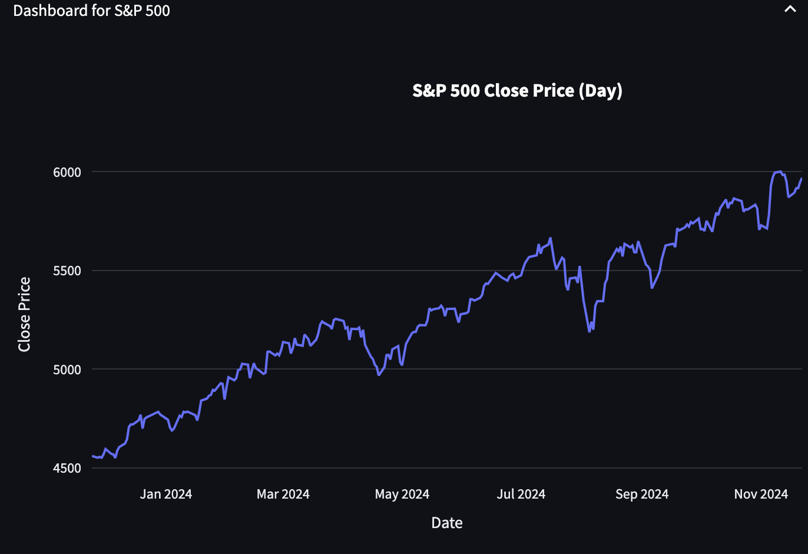
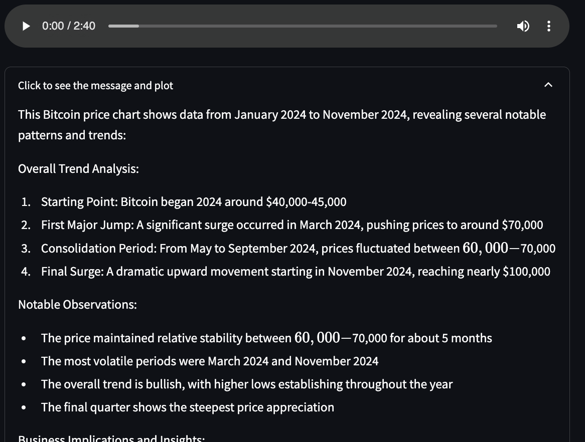

 

# Demo Buisness Inteligence 2.0

Modern BI solution combining three key features:
- **Pull-based Dashboards**: Allow users to select dashboards and customize the time grouping like regular dashboards.
- **Push-based Dashboards**: push based data and offer an alternative way to the overwhelming amonut of dashboards/plots by converting insights/explanations to  audio summary.
- **Recommendation-based Dashboards**: Dashboard Layout based on your interaction history and usage patterns, your title and so on.

<div style="display: flex; justify-content: space-between; align-items: center;">
    
    
</div>

The following demo can be seen [here](https://personlizeddashboards-wc6vnavk25wbsqwuy8zx7v.streamlit.app/)

## Local Installation
### Cloning and Install dependencies
```shell:
git clone https://github.com/yourusername/bi-dashboard-poc
cd bi-dashboard-poc
pip install -r requirements.txt
```
### Cloning and Install dependencies
- Running demo app
```shell
streamlit run app.py
```
- Visit [`http://localhost:8501`](http://localhost:8501) in your browser.

